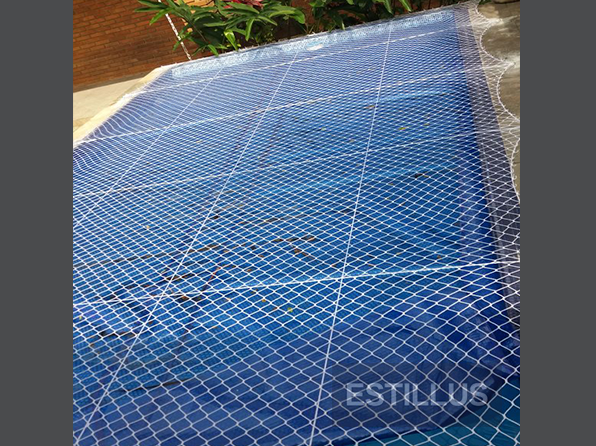
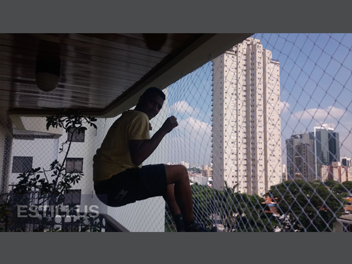

<!DOCTYPE html>
<html lang="pt-br">
  <head>
    <!-- Required meta tags -->
    <meta charset="utf-8">
    <meta name="viewport" content="width=device-width, initial-scale=1, shrink-to-fit=no">
    <meta name="keywords" content="Rede, Tela, Proteção, Estillus, Sacada, Protecao, Telas, Redes">
    <meta name="viewport" content="width=device-width, initial-scale=1, maximum-scale=1">
    <meta name="author" content="Grayrids">
    <title>Estillus .:. Redes de Proteção</title>

    <!-- Bootstrap CSS -->
    <link rel="stylesheet" href="css/bootstrap.min.css">
    <link rel="stylesheet" href="css/font-awesome.min.css">
    <link rel="stylesheet" href="css/line-icons.css">
    <link rel="stylesheet" href="css/owl.carousel.css">
    <link rel="stylesheet" href="css/owl.theme.css">
    <link rel="stylesheet" href="css/nivo-lightbox.css">
    <link rel="stylesheet" href="css/magnific-popup.css">
    <link rel="stylesheet" href="css/slicknav.css">
    <link rel="stylesheet" href="css/animate.css">
    <link rel="stylesheet" href="css/main.css">    
    <link rel="stylesheet" href="css/responsive.css">

    <link rel="shortcut icon" type="image/png" href="img/favicon.png"/>

    

  </head>
  <body>

    <!-- Header Section Start -->
    <header id="hero-area" data-stellar-background-ratio="0.5">    
      <!-- Navbar Start -->
      <nav class="navbar navbar-expand-lg fixed-top scrolling-navbar indigo">
        

          <!-- Brand and toggle get grouped for better mobile display -->
          

            
            <button class="navbar-toggler" type="button" data-toggle="collapse" data-target="#main-navbar" aria-controls="main-navbar" aria-expanded="false" aria-label="Toggle navigation">
              <i class="lnr lnr-menu"></i>
            </button>
          

          

            <ul class="navbar-nav mr-auto w-100 justify-content-end">
              <li class="nav-item">
                <a class="nav-link page-scroll" href="#hero-area">Home</a>
              </li>
              <!--li class="nav-item">
                <a class="nav-link page-scroll" href="#services">Serviços</a>
              </li-->
              <li class="nav-item">
                <a class="nav-link page-scroll" href="#features">Qualidade</a>
              </li>
              <li class="nav-item">
                <a class="nav-link page-scroll" href="#portfolios">Galeria</a>
              </li>
              <!--li class="nav-item">
                <a class="nav-link page-scroll" href="#pricing">Pricing</a>
              </li-->
              <!--li class="nav-item">
                <a class="nav-link page-scroll" href="#team">Team</a>
              </li-->
              <!--li class="nav-item">
                <a class="nav-link page-scroll" href="#blog">Blog</a>
              </li-->
              <li class="nav-item">
                <a class="nav-link page-scroll" href="#contact">Contato</a>
              </li>
            </ul>
          

        

        <!-- Mobile Menu Start -->
        <ul class="mobile-menu">
           <li>
              <a class="page-scroll" href="#hero-area">Home</a>
            </li>
            <!--li>
              <a class="page-scroll" href="#services">Serviços</a>
            </li-->
            <li>
              <a class="page-scroll" href="#features">Qualidade</a>
            </li>
            <li>
              <a class="page-scroll" href="#portfolios">Galeria</a>
            </li>
    
            <li>
              <a class="page-scroll" href="#contact">Contato</a>
            </li>
        </ul>
        <!-- Mobile Menu End -->

      </nav>
      <!-- Navbar End -->   
      
      
        

          

            

              <h1 class="wow fadeInDown" data-wow-duration="1000ms" data-wow-delay="0.3s">
                Preocupado com a segurança e o bem-estar?
              </h1>
              

                Entre em contato e faremos uma análise no seu ambiente para projetarmos sua tranquilidade.
              

              
            

          

        
 
      
           
    </header>
    <!-- Header Section End --> 

    <!-- Services Section Start -->
    <!--section id="services" class="section">
      

        
          
          <h2 class="section-title wow fadeIn" data-wow-duration="1000ms" data-wow-delay="0.3s">Nossos Serviços</h2>
          

          

            Conheça nossos serviços.
          

        

        

          

            

              

                <i class="lnr lnr-checkmark-circle"></i>
              

              <h4>Segurança</h4>
              

                Proteja sua família.  
                Janelas podem representar um risco muito grande de acidentes. Com as redes de proteção nas janelas, você tem tranquilidade para deixar as mesmas abertas.
              

            

          

          

            

              

                <i class="lnr lnr-checkmark-circle"></i>
              

              <h4>Estilo</h4>
              

                Tenha segurança em seu lar com estilo. 
                Trabalhamos com excelência construindo um ambiente para você com segurança e estilo.
              

            

          

          

            

              

                <i class="lnr lnr-checkmark-circle"></i>
              

              <h4>Pet</h4>
              

                Segurança para seu pet.  
                Para você que possui animais de estimação, nada como garantir a segurança dos que amamos. Proteja seu gato, cão e até mesmo aves e deixe-os livres dentro do seu lar. Faça do seu lar um ambiente de liberdade para seu pet.
              

            

          

        

      

    </section-->
    <!-- Services Section End -->

    <!-- Features Section Start -->
    <section id="features" class="section" data-stellar-background-ratio="0.2">
      

        
          
          <h2 class="section-title">Especificações e Qualidade</h2>
          

          

            A Estillus Redes de Proteção, trabalha com o que há de melhor no mercado em relação à qualidade e durabilidade. Trabalhamos com redes fabricadas pela Equiplex ®, com diversas cores e tamanhos, variando de acordo com o uso.
          

        

        

          

            

              

                 

                    
                      <i class="lnr lnr-thumbs-up"></i>
                    
                    

                      <h4>Material da rede</h4>
                      

                        Polietileno - Suporta de 500 a 600kg por m².
                        Material regularizado de acordo com as normas de seguranças implementadas pelo INMETRO e Corpo de Bombeiro.
                      

                    

                  

                  

                    
                      <i class="lnr lnr-thumbs-up"></i>
                    
                    

                      <h4>Garantia</h4>
                      
5 anos de garantia

                    

                  

                  

                    
                      <i class="lnr lnr-layers"></i>
                    
                    

                      <h4>Resistente e seguro</h4>
                      

                        Segurança para seu lar.
                        Resistência a intempéries.
                        Tratamento antioxidante e não absorve água.
                      

                    

                  

                  

                    
                      <i class="lnr lnr-cog"></i>
                    
                    

                      <h4>Cores da rede</h4>
                      

                        Cristal, areia, preta, marrom.
                      

                    

                  

              

            

          

          

            

              
            

          

        

      

    </section>
    <!-- Features Section End -->    

    <!-- Portfolio Section -->
    <section id="portfolios" class="section">
      <!-- Container Starts -->
      

        
          
          <h2 class="section-title">Galeria</h2>
          

          
Confira nossos trabalhos.

        

        
          
          

            <!-- Portfolio Controller/Buttons -->
            

              <a class="filter btn btn-common" data-filter="all">
                Todos 
              </a>
              <a class="filter active btn btn-common" data-filter=".janela">
                Janelas 
              </a>
              <a class="filter btn btn-common" data-filter=".sacada">
                Sacadas
              </a>
              <a class="filter btn btn-common" data-filter=".quadra">
                Quadra 
              </a>
              <a class="filter btn btn-common" data-filter=".limitador">
                Limitador 
              </a>
              <a class="filter btn btn-common" data-filter=".piscina">
                Piscina 
              </a>
              <a class="filter btn btn-common" data-filter=".escada">
                Escada 
              </a>
            

            <!-- Portfolio Controller/Buttons Ends-->
          

          <!-- Portfolio Recent Projects -->
          

            <!--Fotos janela-->
            

              

                

                    
                  <a class="overlay lightbox" href="img/portfolio/janela1.jpg">
                    <i class="lnr lnr-eye item-icon"></i>
                  </a>
                
               
              

            

            

              

                

                    
                  <a class="overlay lightbox" href="img/portfolio/janela2.jpg">
                    <i class="lnr lnr-eye item-icon"></i>
                  </a>
                
               
              

            

            

              

                

                    
                  <a class="overlay lightbox" href="img/portfolio/janela3.jpg">
                    <i class="lnr lnr-eye item-icon"></i>
                  </a>
                
               
              

            

            

              

                

                    
                  <a class="overlay lightbox" href="img/portfolio/janela4.jpg">
                    <i class="lnr lnr-eye item-icon"></i>
                  </a>
                
               
              

            

            <!--Fim janelas-->

            

              

                

                    
                  <a class="overlay lightbox" href="img/portfolio/limitador.jpg">
                    <i class="lnr lnr-eye item-icon"></i>
                  </a>
                
               
              

            

            

              

                

                    
                  <a class="overlay lightbox" href="img/portfolio/limitador2.jpg">
                    <i class="lnr lnr-eye item-icon"></i>
                  </a>
                
               
              

            

            

              

                

                    
                  <a class="overlay lightbox" href="img/portfolio/limitador3.jpg">
                    <i class="lnr lnr-eye item-icon"></i>
                  </a>
                
               
              

            

            

              

                

                    
                  <a class="overlay lightbox" href="img/portfolio/piscina.jpg">
                    <i class="lnr lnr-eye item-icon"></i>
                  </a>
                
               
              

            

            

              

                

                    
                  <a class="overlay lightbox" href="img/portfolio/quadra.jpg">
                    <i class="lnr lnr-eye item-icon"></i>
                  </a>
                
               
              

            

            

              

                

                    
                  <a class="overlay lightbox" href="img/portfolio/quadra2.jpg">
                    <i class="lnr lnr-eye item-icon"></i>
                  </a>
                
               
              

            

            <!--Sacadas-->
            

              

                

                    
                  <a class="overlay lightbox" href="img/portfolio/sacada1.jpg">
                    <i class="lnr lnr-eye item-icon"></i>
                  </a>
                
               
              

            

            

              

                

                    
                  <a class="overlay lightbox" href="img/portfolio/sacada2.jpg">
                    <i class="lnr lnr-eye item-icon"></i>
                  </a>
                
               
              

            

            

              

                

                    
                  <a class="overlay lightbox" href="img/portfolio/sacada3.jpg">
                    <i class="lnr lnr-eye item-icon"></i>
                  </a>
                
               
              

            

            

              

                

                    
                  <a class="overlay lightbox" href="img/portfolio/sacada4.jpg">
                    <i class="lnr lnr-eye item-icon"></i>
                  </a>
                
               
              

            

            
            

              

                

                    
                  <a class="overlay lightbox" href="img/portfolio/sacada6.jpg">
                    <i class="lnr lnr-eye item-icon"></i>
                  </a>
                
               
              

            

            

              

                

                    
                  <a class="overlay lightbox" href="img/portfolio/sacada7.jpg">
                    <i class="lnr lnr-eye item-icon"></i>
                  </a>
                
               
              

            

            

              

                

                    
                  <a class="overlay lightbox" href="img/portfolio/sacada8.jpg">
                    <i class="lnr lnr-eye item-icon"></i>
                  </a>
                
               
              

            

            

              

                

                    
                  <a class="overlay lightbox" href="img/portfolio/sacada9.jpg">
                    <i class="lnr lnr-eye item-icon"></i>
                  </a>
                
               
              

            

            

              

                

                    
                  <a class="overlay lightbox" href="img/portfolio/sacada10.jpg">
                    <i class="lnr lnr-eye item-icon"></i>
                  </a>
                
               
              

            

            

              

                

                    
                  <a class="overlay lightbox" href="img/portfolio/sacada11.jpg">
                    <i class="lnr lnr-eye item-icon"></i>
                  </a>
                
               
              

            

            

              

                

                    
                  <a class="overlay lightbox" href="img/portfolio/sacada12.jpg">
                    <i class="lnr lnr-eye item-icon"></i>
                  </a>
                
               
              

            

            

              

                

                    
                  <a class="overlay lightbox" href="img/portfolio/sacada13.jpg">
                    <i class="lnr lnr-eye item-icon"></i>
                  </a>
                
               
              

            

            

              

                

                    
                  <a class="overlay lightbox" href="img/portfolio/sacada14.jpg">
                    <i class="lnr lnr-eye item-icon"></i>
                  </a>
                
               
              

            

            

              

                

                    
                  <a class="overlay lightbox" href="img/portfolio/escada_caracol.jpg">
                    <i class="lnr lnr-eye item-icon"></i>
                  </a>
                
               
              

            

            <!--fim fotos sacada-->

          

        

      

      <!-- Container Ends -->
    </section>
    <!-- Portfolio Section Ends --> 

    <!-- Start Video promo Section -->
    <section class="video-promo section">
      

        

          

              

                <h2 class="wow zoomIn" data-wow-duration="1000ms" data-wow-delay="100ms">Video 1</h2>
                

                  Vídeo 1
                

                <a href="https://www.youtube.com/watch?v=gh2f2LQdlEo" class="video-popup wow fadeInUp" data-wow-duration="1000ms" data-wow-delay="0.3s"><i class="lnr lnr-film-play"></i></a>
              

          

          

              

                <h2 class="wow zoomIn" data-wow-duration="1000ms" data-wow-delay="100ms">Video 2</h2>
                

                  Vídeo 2
                

                <a href="https://www.youtube.com/watch?v=yq5Gb0tvePE" class="video-popup wow fadeInUp" data-wow-duration="1000ms" data-wow-delay="0.3s"><i class="lnr lnr-film-play"></i></a>
              

          

        

      

    </section>
    <!-- End Video Promo Section -->

    
    <!-- Contact Section Start -->
    <section id="contact" class="section" data-stellar-background-ratio="-0.2">      
      

        

          
     
            

              

                <h3>Entre em contato</h3>
                

                  
Celular: (11 99516-9335)

                  
Comercial: (11 3384-5479)

                  
Celular: (13 98151-4776)

                  
E-mail: (estillus.redesdeprotecao@gmail.com)

                

                

                  <ul>
                    <!--li class="facebook"><a href="#"><i class="fa fa-facebook"></i></a></li>
                    <li class="twitter"><a href="#"><i class="fa fa-twitter"></i></a></li>
                    <li class="google-plus"><a href="#"><i class="fa fa-google-plus"></i></a></li>
                    <li class="linkedin"><a href="#"><i class="fa fa-linkedin"></i></a></li>
                    <li class="dribbble"><a href="#"><i class="fa fa-dribbble"></i></a></li-->
                  </ul>
                

              

            
     
            <!--div class="col-lg-6 col-sm-6 col-xs-12">
              

                <form id="contactForm">
                  

                    

                      

                        <input type="text" class="form-control" id="name" name="name" placeholder="Informe seu nome" required data-error="Informe seu nome">
                        

                      
                                 
                    

                    

                      

                        <input type="text" placeholder="Informe seu Email" id="email" class="form-control" name="name" required data-error="Informe seu email">
                        

                      
 
                    

                    

                      
 
                        <textarea class="form-control" id="message" placeholder="Digite sua mensagem" rows="8" data-error="Digite sua mensagem" required></textarea>
                        

                      

                      

                        <button class="btn btn-common" id="submit" type="submit">Enviar Mensagem</button>
                        

 
                        

 
                      

                    

                  
            
                </form>
              

            </div-->
          

        

      
           
    </section>
    <!-- Contact Section End -->

    <!-- Footer Section Start -->
    <footer>          
      

        

          <!-- Footer Links -->
          

            <ul class="footer-links">
              <li>
                <a href="#">Home</a>
              </li>
              <!--li>
                <a href="#services">Serviços</a>
              </li-->
              <li>
                <a href="#portfolios">Galeria</a>
              </li>
            </ul>
          

          

            

              
All copyrights reserved &copy; 2018 - Estillus Redes e Proteção
                
              

            

          
  
        

      

    </footer>
    <!-- Footer Section End --> 

    <!-- Go To Top Link -->
    <a href="#" class="back-to-top">
      <i class="lnr lnr-arrow-up"></i>
    </a>
    
    

      

        

        

      

    
     

    <!-- jQuery first, then Tether, then Bootstrap JS. -->
    
    
    
    
    
        
        
        
        
        
        
         
       
    
        
        
        
    
       
    

  </body>
</html>